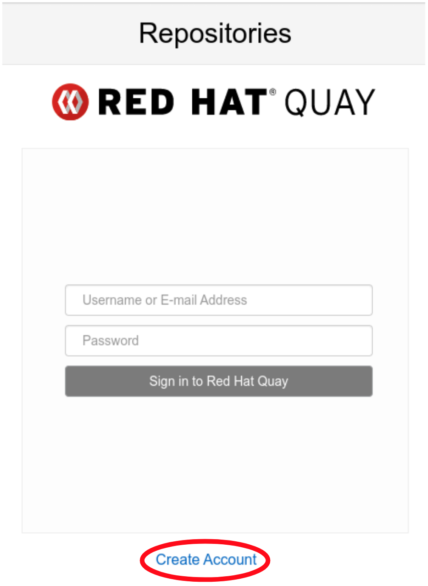
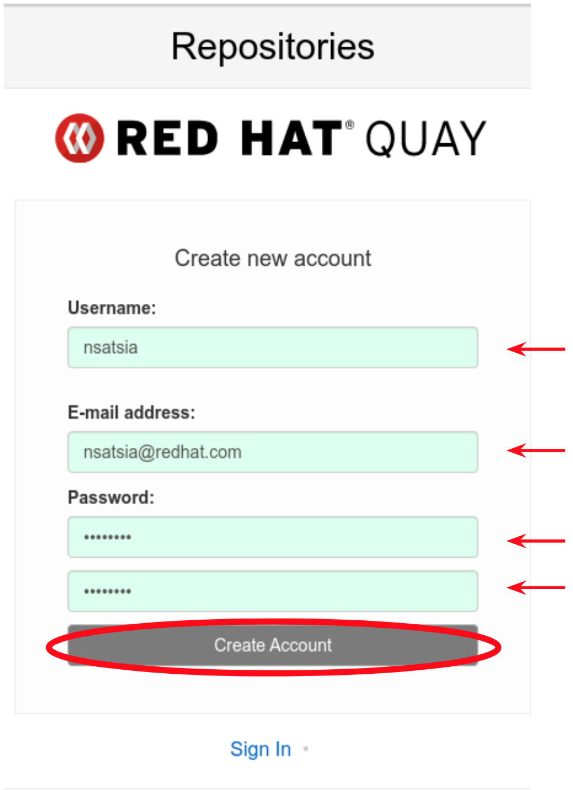
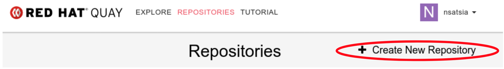
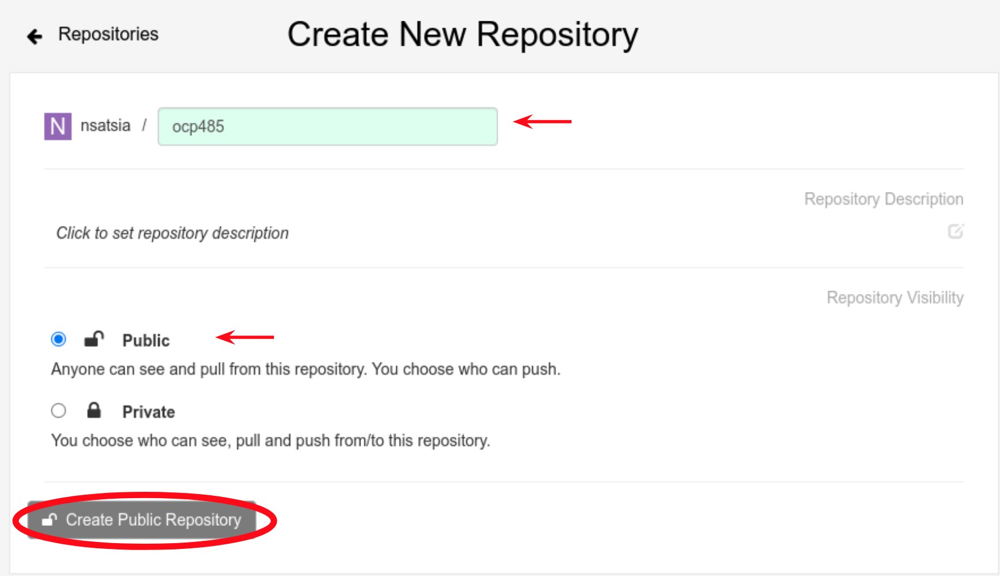
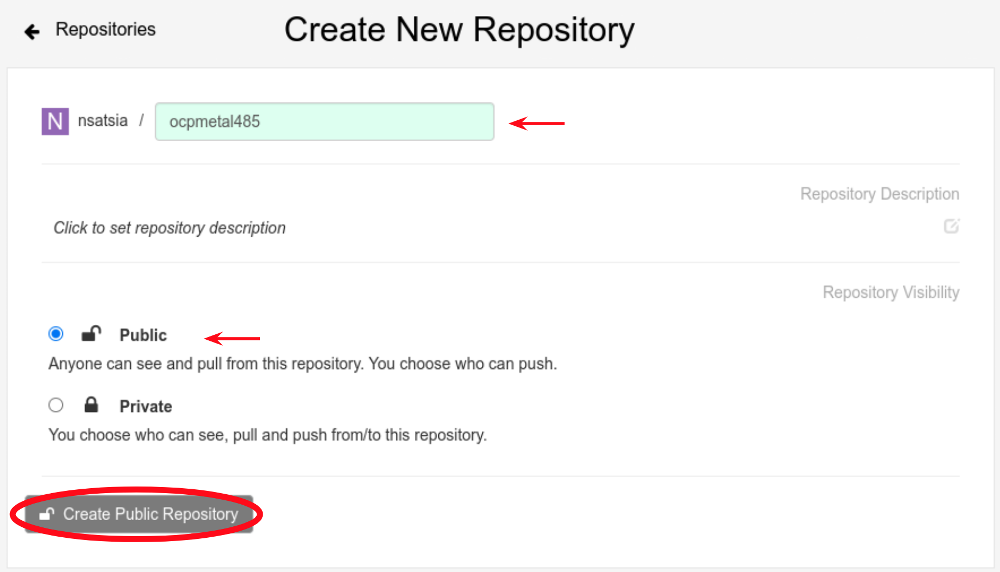

## Get the local openshift-operators URL

```bash
oc get route -n openshift-operators | egrep "\-quay " | awk '{print $2}'
```
This URL **must** match the FQDN of the certificate you previously created.

On 1st login to the site you will need to create a user, select "Create Account" and complete the required fields for your user. Example below.

---
<p align="center">
  
</p>

---


---
<p align="center">
  
</p>

---

Once the account is created, login and create 2 "public" repositories names "ocp4817" and "ocpmetal4817" as illustrated below.

**ADJUST** numbering to reflect the release you will mirror


---
<p align="center">
  
</p>

---

---
<p align="center">
  
</p>

---

---
<p align="center">
  
</p>

---
